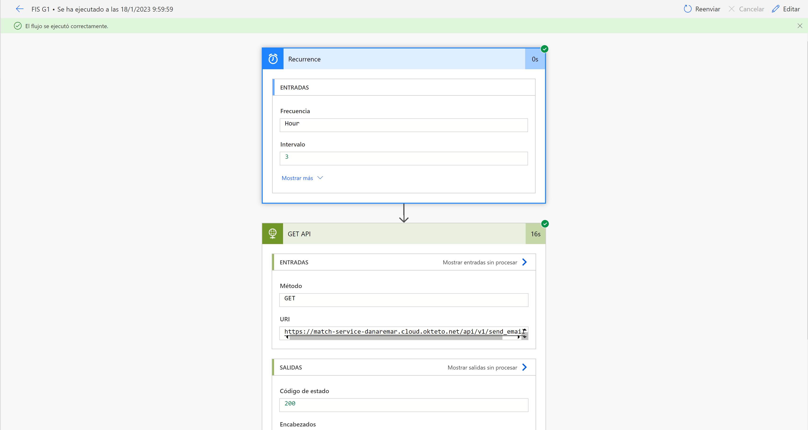

# Match service

## Introducción
Este microservicio es parte de la aplicación [Footmatch](https://github.com/orgs/Football-FIS/repositories)., proyecto para la asignatura "*Fundamentos de Ingeniería Software para Cloud*" del "*Máster en Ingeniería del Software: Cloud, Datos y Gestión TI*" en la *Universidad de Sevilla*.

La función de este microservicio es proveer de información sobre los partidos asociados a un equipo. Además, proveerá al microservicio "*team-service*" de los partidos cuyas notificaciones deberían ser enviadas.

### Autores
- Daniel Arellano Martínez
- Brian Calatrava Hurtado

## Tecnologías
Para el desarrollo de este microservicio se han usado las siguientes tecnologías:

 - **Django** (backend)
 - **MongoDB** (BBDD NoSQL)
 - **Swagger** (documentación API)
 - **Djongo** (conector MongoDB - Django)
 - **Docker** (gestor de contenedores)
 - **Okteto** (despliegue en cloud)

## APIs relacionadas
Se ha usado la API Rest **OpenWeather** para la predicción meteorológica en función de la fecha de inicio de partido y la ciudad en la que se situará el encuentro.

## Requisitos de proyecto
Tanto la aplicación cumplen los requisitos para una **calificación de 9**. A continuación se listarán los requisitos, así como las distintas evidencias:

### Microservicio avanzado

 - **Rutas y navegación**: se ha implementado el control de rutas y navegación con respecto al frontend. Además, se ha controlado el uso de componentes tal y como se explica en la documentación de la asignatura, perteneciendo cada uno de los componentes a un microservicio diferente. Puede apreciarse en el fichero de configuración de rutas de Angular [app-routing.module.ts](https://github.com/Football-FIS/footmatch-frontend/blob/develop/src/app/app-routing.module.ts).
 - **Caché frontend**: se implementa una caché de tipo localStorage para listar "mis partidos", para agilizar la carga de esta. Puede apreciarse en las funciones "*getMyMatchesInCache*" y " *setMyMatchesInCache*" dentro de los ficheros [match.service.ts](https://github.com/Football-FIS/footmatch-frontend/blob/develop/src/app/services/match.service.ts) y [my-matches.component.ts](https://github.com/Football-FIS/footmatch-frontend/blob/develop/src/app/my-matches/my-matches.component.ts).
 - **Consumir API externa**: se consume la API Rest OpenWeather. Puede apreciarse en la función "*get_weather*" del fichero [views.py](https://github.com/Football-FIS/match-service/blob/develop/match_service/match_api/views.py).
 - **Autenticación JWT**: permite realizar operaciones en función de los permisos del usuario y de si los partidos son de su propiedad. Se redirecciona la cabecera "*Bearer*" al microservicio "*team-service*". Puede apreciarse en la función "*validate_token*" del fichero [views.py](https://github.com/Football-FIS/match-service/blob/develop/match_service/match_api/views.py).
 - **Peticiones automáticas con PowerAutomate**: consiste en un flujo online que permite llamar al endpoint cada 3 horas. A continuación, se mostrará una imagen demostrando una ejecución exitosa sobre este endpoint.

### Aplicación basada en microservicios avanzados

 - **Frontend común que integra otros frontends**: han colaborado todos los equipos con sus correspondientes componentes en el servicio [footmatch-frontend](https://github.com/Football-FIS/footmatch-frontend).
 - **Mecanismo de autenticación común (JWT)**: todos los microservicios validan el token JWT para obtener el usuario y validar si puede realizar dicha operación.
 - **ElectronJS**: permite compilar la aplicación como aplicación de escritorio. Puede observarse en el servicio [footmatch-frontend](https://github.com/Football-FIS/footmatch-frontend) en los ficheros [package.json](https://github.com/Football-FIS/footmatch-frontend/blob/develop/package.json) y [main.js](https://github.com/Football-FIS/footmatch-frontend/blob/develop/main.js).

### Pruebas realizadas en el Microservicio

En nuestro servicio se realizaron los siguientes tests:
Se debe tomar en cuenta que nuestros tests se encuentran en el siguiente archivo [tests.py](https://github.com/Football-FIS/match-service/blob/develop/match_service/match_api/tests.py).

 - **Tests de Componentes**: Comienzan desde la línea 47 hasta 448. Se han realizado un total de 12 tests.
 - **Tests de Integración(Team-Service y la API externa OpenWeather)**: Continuan desde la línea 451 hasta la 560. Se han realizado un total de 7 tests.
 - **Tests de Integracion con la BBDD**: El último test ubicado en la línea 561. Se ha realizado un 1 test.

### Otros requisitos

 - Mínimo de 20 pruebas de componente
 - Determinar el coste de cada plan del customer agreement
 - API Rest documentado con Swagger
 - 5 características de microservicio avanzado
 - 3 características de aplicación basada en microservicios avanzados

## Lanzar aplicación

### Local
Opción recomendable para depuración. Requiere tener instalado python así como las librerías contenidas dentro del "*requirements.txt*".

    python ./match_service/manage.py runserver

### Docker
Opción recomendable para iniciar el servicio sin tener en cuenta las dependencias. Requiere tener habilitada la virtualización en el sistema operativo (en Windows el WSL2) y Docker instalado.

    docker -> docker compose up

### Docker-service
Opción para desplegar todos los microservicios al completo. Requiere los mismos requisitos que Docker. Para más información mirar: https://github.com/Football-FIS/docker-service

## SWAGGER
Documenta las posibles peticiones así como los modelos y posibles respuestas de la API Rest de este microservicio.
**Local**: http://localhost:8000/api/v1/docs/
**Producción**: https://match-service-danaremar.cloud.okteto.net/api/v1/docs/

